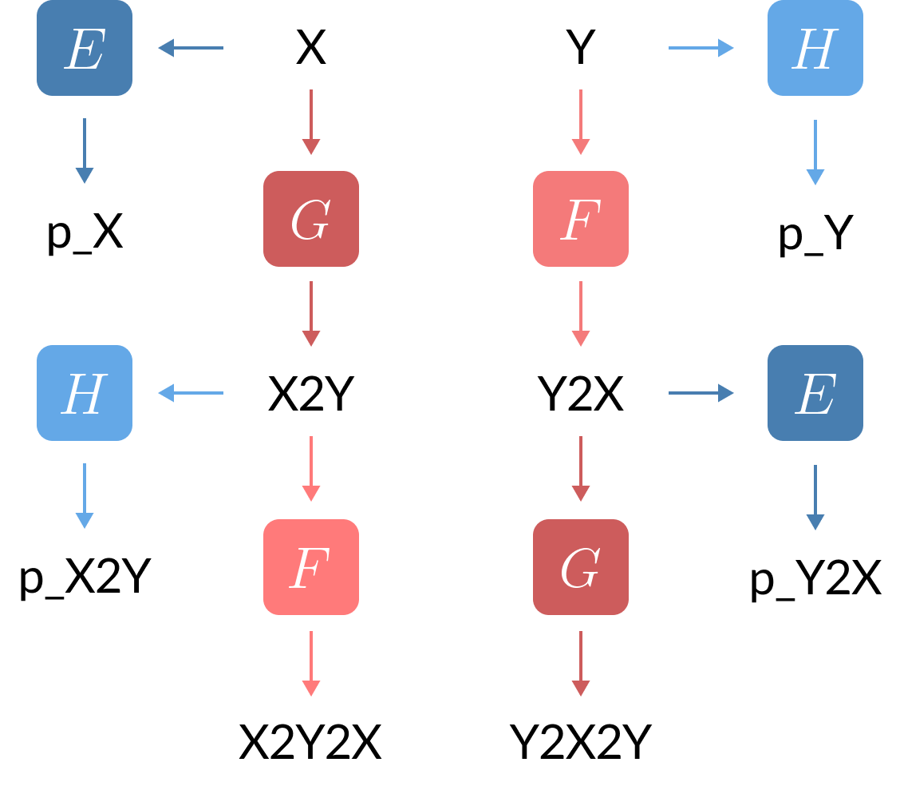
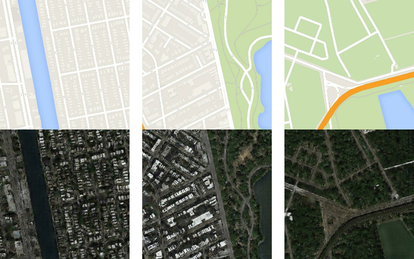
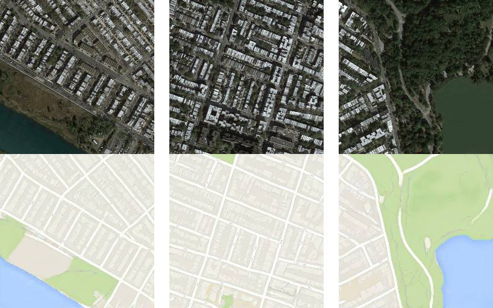

# CycleGAN - TensorFlow 2

This is an implementation of [CycleGAN](https://arxiv.org/pdf/1703.10593.pdf) for unsupervised map-to-aerial and aerial-to-map translation (i.e., using unpaired training data). The framework consists of two generators (G and F) and two discriminators (E and H):

<br/>



<br/>

## Results

Map (top) to aerial photo (bottom):



Aerial photo (top) to map (bottom):



To generate these translations, I have trained the GAN for 200k update steps (around 26 hours on a Tesla T4 GPU). The weights of the generators are available in the pretrained/ directory.

<br/>

## Software installation

Clone this repository:

```bash
git clone https://github.com/garder14/cyclegan-tensorflow2.git
cd cyclegan-tensorflow2/
```

Install the dependencies:

```bash
conda create -n tfenv python=3.8 tensorflow-gpu=2.2
conda activate tfenv
pip install tensorflow_addons==0.11.2
```

<br/>

## Training

Download and pre-process the dataset of maps and aerial photos:

```bash
wget http://efrosgans.eecs.berkeley.edu/pix2pix/datasets/maps.tar.gz
tar -xvf maps.tar.gz
python prepare_aerial2map_dataset.py
rm -r maps maps.tar.gz
```

Train the models:

```bash
python train.py
```

<br/>

## Testing

To translate an image to the other domain, you need to specify the path to the appropriate generator's weights. For example:

```bash
python test.py --image ./aerial2map/map/test/156.jpg --weights ./pretrained/map2aerial.h5
``` 
```bash
python test.py --image ./aerial2map/aerial/test/676.jpg --weights ./pretrained/aerial2map.h5
``` 

<br/>

## References

* [J. Y. Zhu, T. Park, P. Isola, and A. A. Efros, "Unpaired Image-to-Image Translation using Cycle-Consistent Adversarial Networks", 2017](https://arxiv.org/pdf/1703.10593.pdf)

* [Official PyTorch implementation of CycleGAN](https://github.com/junyanz/pytorch-CycleGAN-and-pix2pix)
